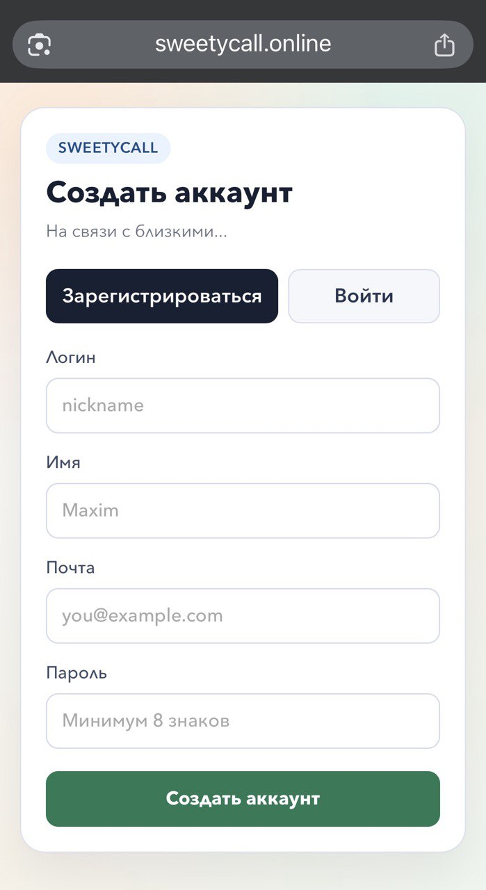
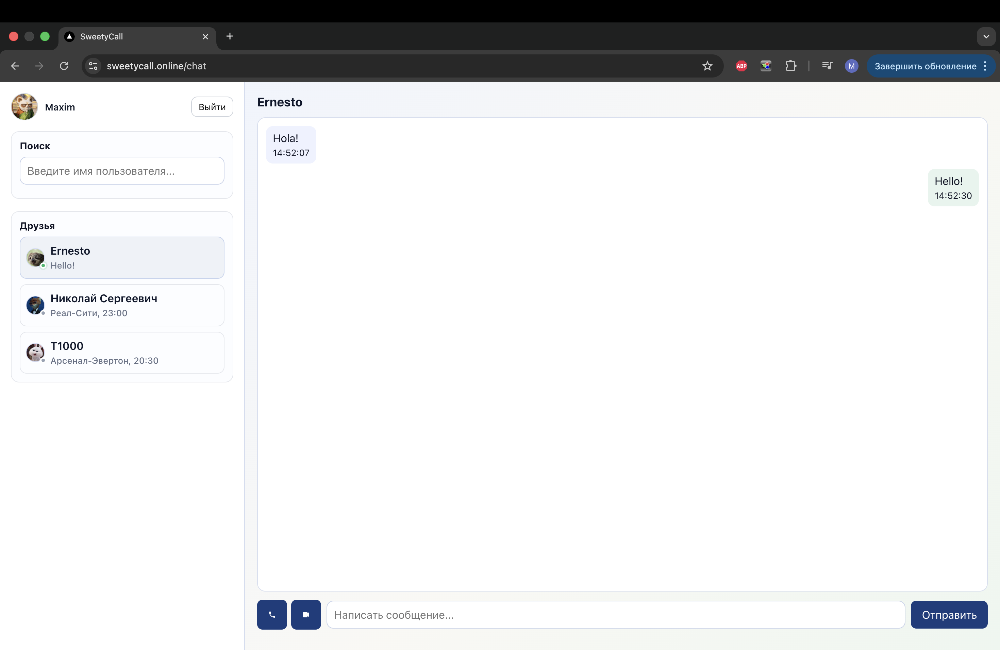
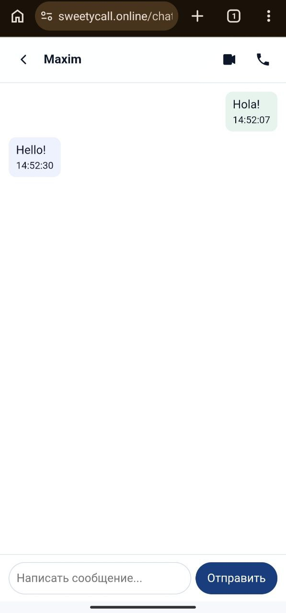
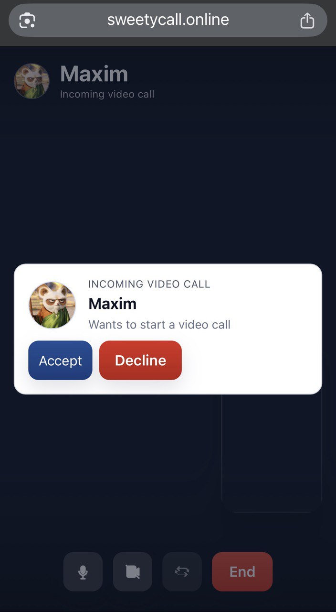

# SweetyCall Messenger

Realtime fullstack messenger

## Stack

- Backend: NestJS, Prisma, PostgreSQL, Redis, Socket.IO, JWT
- Frontend: Next.js (App Router), React, React Query, Axios, Socket.IO client
- Infra: Docker, Docker Compose, Nginx, VPS Linux

## Monorepo Structure

```text
apps/
  api/   NestJS backend (REST API + Socket.IO)
  web/   Next.js frontend
```

## Features
User registration and authentication (JWT access + refresh tokens)
User search
Friends system (requests + accept/decline)
Direct conversations
Realtime messaging via Socket.IO
Online/offline presence
Unread message counters and previews
Audio and video calls (WebRTC)
Camera switching on mobile devices
Responsive UI (desktop and mobile chat UX)

## Quick Start (Local)

1. Start infra:

```bash
docker compose -f docker-compose.dev.yml up -d
```

2. Start API:

```bash
cd apps/api
cp .env.example .env
npm install
npm run prisma:generate
npm run prisma:migrate:dev
npm run start:dev
```

3. Start Web:

```bash
cd apps/web
npm install
npm run dev
```

## Production Deployment

The project is deployed on a VPS using Docker Compose.

Update flow:

git pull
docker compose up -d --build

Basic post-deploy checks:

docker compose ps
docker compose logs api --tail=100
docker compose logs web --tail=100
docker compose exec nginx nginx -t

## Documentation

- [Architecture Overview](docs/architecture.md)

## Screenshots

> Put image files into `docs/screenshots/` with these names.

### Auth (Mobile)



### Chat (Desktop)



### Chat (Mobile)



### Incoming Video Call (Mobile)


